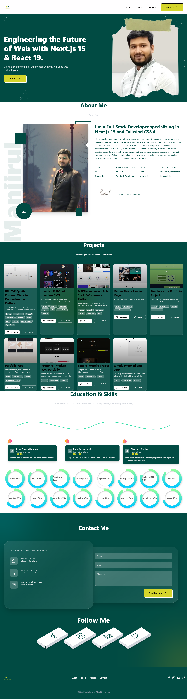

# [Manjirul Shishir - Professional Full-Stack Portfolio]

[](https://nextjs.org/)
[](https://react.dev/)
[](https://tailwindcss.com/)
[](https://opensource.org/licenses/MIT)

## 📌 Project Overview
**Manjirul Shishir's Portfolio** is a high-performance, visually immersive digital experience designed to showcase the intersection of advanced engineering and modern design. Built using the latest **Next.js 15** and **React 19** features, it serves as a professional gateway for potential employers and clients to explore technical projects, skills, and industry experience.

### 🧩 The Problem It Solves
In a saturated market, static portfolios often fail to reflect a developer's true technical depth. This project addresses the need for a **dynamic, performance-optimized, and aesthetically superior** platform that demonstrates mastery over complex UI animations, server-side logic, and responsive architecture.

---

## ✨ Key Features
- **Modern Tech Stack:** Leveraging the bleeding edge of web development with Next.js 15 and React 19.
- **Immersive Animations:** Utilizing **GSAP (GreenSock)** and **ScrollTrigger** for sophisticated, scroll-based transitions and **tsparticles** for interactive background depth.
- **Glassmorphic UI Design:** A sleek, semi-transparent aesthetic with frosted-glass effects across cards and navigation.
- **Dynamic Project Showcase:** A responsive grid system featuring detailed project cards with tech-stack tagging and direct links.
- **Interactive Skill Visualization:** Custom-built circular progress indicators and a zigzag timeline for educational history.
- **Functional Contact System:** A robust contact form integrated with a **Nodemailer** backend for direct email delivery via SMTP.
- **Optimized Performance:** Image optimization via `next/image` and dynamic imports for heavy animation components to ensure rapid load times.

---

## 🛠 Tech Stack
- **Frontend:** React 19, Next.js 15 (App Router), TypeScript.
- **Styling:** Tailwind CSS 4 (utilizing modern `@theme` variables).
- **Animation:** GSAP, ScrollTrigger, tsparticles.
- **Icons:** Lucide React.
- **Backend/API:** Next.js Serverless Functions, Nodemailer.
- **Deployment:** Vercel.

---

## 🚀 Live Demo & Repository
- **Live Demo:** [https://manjirulshishir.vercel.app](https://manjirulshishir.vercel.app)
- **GitHub Repository:** [https://github.com/Shishir269646/Manjirul-Shishir](https://github.com/Shishir269646/Manjirul-Shishir)

---

## 💻 Installation & Setup

### 1. Clone the repository
```bash
git clone https://github.com/Shishir269646/manjirulshishir.git
cd manjirulshishir
```

### 2. Install dependencies
```bash
npm install
```

### 3. Configure Environment Variables
Create a `.env.local` file in the root directory and add your SMTP credentials:
```env
SMTP_HOST=your_smtp_host
SMTP_PORT=465
SMTP_USER=your_email@example.com
SMTP_PASS=your_email_password
RECIPIENT_EMAIL=your_personal_email@example.com
```

### 4. Run the development server
```bash
npm run dev
```
Open [http://localhost:3000](http://localhost:3000) with your browser to see the result.

---

## 📸 Screenshots


- **Hero Section:** High-performance landing page with interactive particles.
- **Project Grid:** Glassmorphic cards showcasing recent work.
- **Contact Form:** Fully functional SMTP-integrated messaging system.

---

## 📱 Responsiveness
This project is **Fully Responsive**. It employs a mobile-first design strategy, ensuring a seamless experience across:
- Ultra-wide monitors
- Standard Laptops/Desktops
- Tablets
- Smartphones

---

## 📝 Notes
- **Authentication:** Not required (Public Portfolio).
- **Deployment:** Optimized for Vercel with Turbopack support for ultra-fast builds.
- **Customization:** All content (projects, skills, education) is centralized in modular components for easy updates.

---

## 🤝 Closing Note
Thank you for visiting my portfolio. This project represents my commitment to building high-quality, scalable, and beautiful web applications. If you're interested in collaborating or have any questions, feel free to reach out via the contact form!

**Designed & Developed with ❤️ by Manjirul Islam Shishir**
